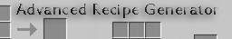
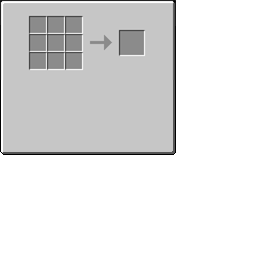

# Advanced Recipe Generator

   

   Download Links:   http://www.siedler25.org/uploads/minecraft/AdvancedRecipeGenerator/

   Please report any bugs to GitHUB: https://github.com/Flow86/Advanced-Recipe-Generator-Mod

## Information/Purpose

   This mod creates recipe images in the form
   
   
   
   on start of minecraft.
   
   It places the files into $minecraft-dir/recipes (usually AppData/.minecraft/recipes).
   
   You can now easily use these generated recipe images on your own mods' wiki/website.

## Installation

   needs [MinecraftForge](https://github.com/MinecraftForge/MinecraftForge)
   
   put it into "mods" folder and run minecraft.
   
   If you add other mods and want to create recipe images for those too, simply run Minecraft. every "missing" recipe image will be generated.
   
## License

   **AdvancedRecipeGenerator is open-source.**

   It is distributed under the terms of my Open Source License.

   It grants rights to read, modify, compile or run the code.

   It does **NOT** grant the right to redistribute this software or its
   modifications in any form, binary or source, except if expressively
   granted by the copyright holder.

   * **Mod Packs:**
      No this Mod is a developer only mod. You are not allowed to redistribute the mod inside a Mod Pack.

   **If you want to distribute a custom/modified arg build, you have to ask for permission first!**
